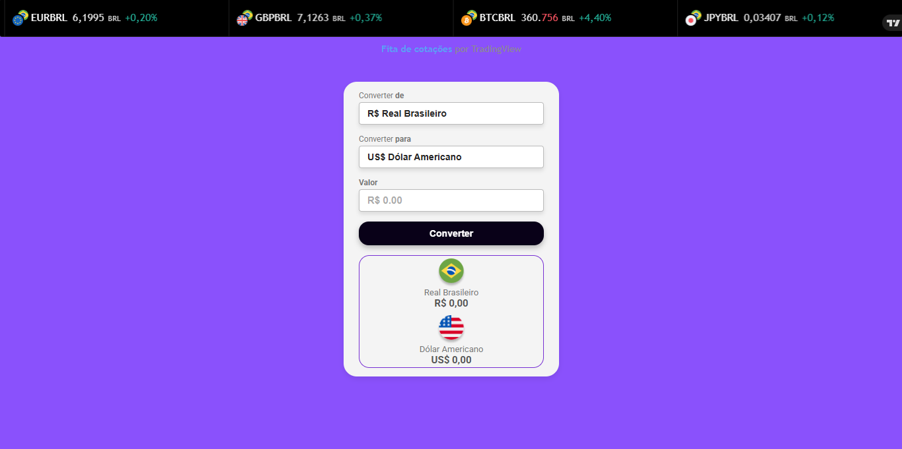

# 💰 devclub-conversor-de-moedas

Este projeto é um conversor de moedas desenvolvido como parte do curso da DevClub, utilizando o material das aulas e com o auxílio de agentes de IA.

---

## 📷 Demonstração do Projeto

Aqui está uma prévia do conversor de moedas em ação:



---

## 🛠️ Tecnologias e APIs utilizadas

- **📝 Linguagens:** JavaScript, HTML, CSS  

- **🌐 API:** [AwesomeAPI - API de Moedas](https://docs.awesomeapi.com.br/api-de-moedas)  

- **📈 Widget:** TradingView Ticker Tape Widget ([documentação](https://www.tradingview.com/widget/ticker-tape/))  

- **🧰 Ferramentas:** VSCode, Git, Github

---

## 🚀 Funcionalidades

- 🔄 Conversão de valores entre diferentes moedas (ex: Real, Dólar, Euro)  

- 📊 Consulta de taxas de câmbio atualizadas via API da AwesomeAPI  

- 📉 Exibição do ticker de moedas via widget TradingView para dados financeiros em tempo real  

- 🎨 Interface amigável e responsiva

---

## 📋 Como usar

1. Clone este repositório para sua máquina local:  
   ```bash
   git clone https://github.com/seuusuario/devclub-conversor-de-moedas.git
